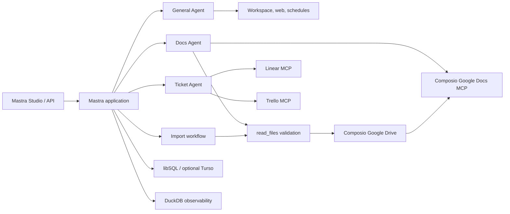

# Personal Docs & Ticket Assistant

A local-first [Mastra](https://mastra.ai) application with specialized agents for document operations, ticket management, web research, workspace tasks, and recurring schedules. It connects Google Docs, Linear, and Trello through Composio while keeping agent memory and development observability in project-controlled storage.

## Why this project

- **One workspace, several specialists:** use a general assistant, a Google Docs agent, or a Linear/Trello ticket agent from Mastra Studio.
- **Deterministic document imports:** validate files before uploading, verify native Google Docs conversion, and return the confirmed document URL.
- **Efficient ticket tooling:** expose only planning-relevant Linear and Trello operations, avoiding oversized prompts and provider tool-name collisions.
- **Local development by default:** keep memory in libSQL, traces in DuckDB, and file operations inside approved project directories.

## Capabilities

| Component | Purpose |
| --- | --- |
| **Agent** | Web research, page fetching, local workspace operations, task tracking, and recurring schedules. |
| **Docs Agent** | Find, read, create, and update Google Docs; import uploaded or approved local documents. |
| **Ticket Agent** | Select Linear or Trello from prompt/context, inspect tickets, summarize work, and draft actionable plans. |
| **Import workflow** | Validate and fingerprint a local document before importing it as a native Google Doc. |

Supported import formats are `.docx`, `.doc`, `.odt`, `.rtf`, `.txt`, `.html`, and `.pdf`, with a maximum size of 5 MB.

## Architecture



Agents handle open-ended decisions and platform routing. The import workflow handles the fixed validation-to-conversion sequence. MCP sessions are created lazily, so application registration and builds do not require live third-party connections.

## Project structure

```text
src/
├── config/                 Environment validation
├── constants/              Shared model and application constants
└── mastra/
    ├── agents/             General, Docs, and Ticket agents
    ├── mcp/                Google Docs, Linear, and Trello clients
    ├── tools/              Document, web, and scheduling tools
    ├── workflows/          Import-file-to-Google-Docs workflow
    └── index.ts            Mastra registration, storage, observability
scripts/                    Mastra Studio attachment compatibility patch
tests/                      Document and MCP tool-name regression tests
workspace/                  Default agent-controlled filesystem root
```

## Setup

Requirements: Node.js 22.13+ and Yarn.

Create `.env` from `.env.example` and configure:

```dotenv
OPENAI_API_KEY=your_openai_api_key
COMPOSIO_API_KEY=your_composio_api_key
COMPOSIO_USER_ID=personal-user
```

`COMPOSIO_USER_ID` is a stable application user identifier, not necessarily an email address. Composio uses it to associate the Google Docs, Google Drive, Linear, and Trello connections.

Optional configuration:

```dotenv
TURSO_DATABASE_URL=
TURSO_AUTH_TOKEN=
DOCUMENT_UPLOAD_DIRS=/absolute/uploads:/another/approved/directory
COMPOSIO_GOOGLEDRIVE_VERSION=20260721_00
```

Run the project:

```shell
yarn dev
```

Open [Mastra Studio](http://localhost:4111), select an agent, and connect the requested service through Composio when prompted.

Useful commands:

```shell
yarn test     # regression tests
yarn build    # production bundle
yarn start    # start a built application
```

## Document import flow

Chat uploads are resolved directly from the Docs Agent execution context with `read_files({})`. Server and workflow callers provide a `filePath` inside `workspace/`, `uploads/`, or a directory configured through `DOCUMENT_UPLOAD_DIRS`.

Before upload, the importer:

1. Resolves and confines the real path, rejecting symlinks and non-regular files.
2. Checks size, extension, MIME metadata, byte signatures, and archive structure.
3. Rejects known macro, script, active-content, encryption, and container hazards.
4. Uploads the exact validated bytes and requests Google-native conversion.
5. Verifies `application/vnd.google-apps.document`, returns the canonical URL, and cleans up the source upload.

These are structural safety checks, not antivirus scanning. Document contents remain untrusted after conversion.

## Ticket routing

The Ticket Agent loads both MCP integrations and selects a platform from explicit names, URLs, IDs, vocabulary, and recent tool context. Ambiguous write requests require clarification. Linear and Trello tools remain separately namespaced, allowlisted, and checked for provider-facing name collisions before every model request.

## Storage and safety

- Agent memory, tasks, and schedules use local `mastra.db` by default; set Turso variables for remote libSQL.
- Observability data uses DuckDB through Mastra’s composite storage.
- File tools stay inside `workspace/`; command approvals should still be reviewed because the local sandbox is not operating-system isolation.
- Recurring schedules continue consuming model tokens until paused with the returned schedule ID.
- The MCP tool cache is process-level and designed for this personal, single-user setup. Use request-scoped sessions before adapting it to multiple users.

## Development notes

`yarn dev` first runs `scripts/patch-mastra-studio-attachments.mjs`. The idempotent patch preserves supported non-PDF uploads as binary message parts; it fails loudly if a future Mastra Studio bundle changes the patched implementation.

Register every new agent, tool, workflow, or scorer in `src/mastra/index.ts`. Use the project scripts rather than invoking `mastra dev` or `mastra build` directly.
