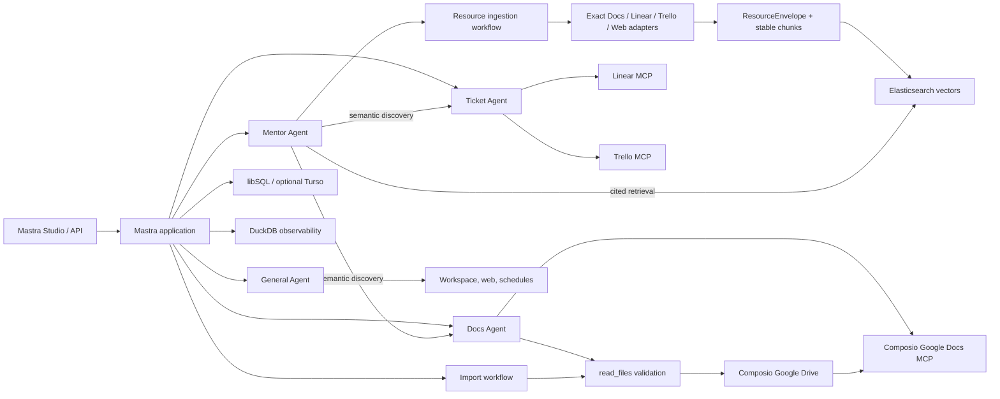

# Daily Mastra Agents - Personal Docs & Ticket Assistant

A local-first [Mastra](https://mastra.ai) application with specialized agents for document operations, ticket management, web research, workspace tasks, recurring schedules, and a citation-first Mentor RAG supervisor. It connects Google Docs, Linear, and Trello through Composio, indexes validated resource snapshots in Elasticsearch, and keeps agent memory and development observability in project-controlled storage.

## Why this project

- **One workspace, several specialists:** use a general assistant, a Google Docs agent, or a Linear/Trello ticket agent from Mastra Studio.
- **Deterministic document imports:** validate files before uploading, verify native Google Docs conversion, and return the confirmed document URL.
- **Efficient ticket tooling:** expose only planning-relevant Linear and Trello operations, avoiding oversized prompts and provider tool-name collisions.
- **Evidence-safe Mentor RAG:** specialists locate resources, typed adapters re-read exact sources, and only validated snapshots enter the knowledge base.
- **Useful static web fetching:** retrieve bounded public pages, remove HTML boilerplate, and return structured failures for unsafe or JavaScript-only targets.
- **Local development by default:** keep memory in libSQL, traces in DuckDB, and file operations inside approved project directories.

## Capabilities

| Component | Purpose |
| --- | --- |
| **Agent** | Web research, page fetching, local workspace operations, task tracking, and recurring schedules. |
| **Docs Agent** | Find, read, create, and update Google Docs; import uploaded or approved local documents. |
| **Ticket Agent** | Select Linear or Trello from prompt/context, inspect tickets, summarize work, and draft actionable plans. |
| **Mentor Agent** | Discover connected sources, ingest exact snapshots, search indexed chunks, and answer with title/URL citations. |
| **Import workflow** | Validate and fingerprint a local document before importing it as a native Google Doc. |
| **Ingestion workflow** | Acquire 1–10 Google Docs, Linear issues, Trello cards, or public web pages independently and replace stable Elasticsearch chunks. |

Supported import formats are `.docx`, `.doc`, `.odt`, `.rtf`, `.txt`, `.html`, and `.pdf`, with a maximum size of 5 MB.

## Architecture



Agents handle open-ended decisions and platform routing. The import workflow handles the fixed validation-to-conversion sequence. Mentor follows a stricter trust boundary: Docs and Ticket agents return candidate locators, deterministic Composio session calls validate and read the selected IDs, and one normalization/chunking pipeline indexes the result. A delegated answer is never itself indexed or cited. MCP sessions are created lazily, so application registration and builds do not require live third-party connections.

## Project structure

```text
src/
├── config/                 Environment validation
├── constants/              Shared model and application constants
└── mastra/
    ├── agents/             General, Docs, Ticket, and Mentor agents
    ├── mcp/                Google Docs, Linear, and Trello clients/sessions
    ├── resources/          Typed references, acquisition adapters, page gateway, vector store
    ├── tools/              Document, static web, and scheduling tools
    ├── workflows/          Document import and Mentor resource ingestion
    └── index.ts            Mastra registration, storage, observability
scripts/                    Mastra Studio attachment compatibility patch
tests/                      Document and MCP tool-name regression tests
workspace/                  Default agent-controlled filesystem root
```

## Setup

Requirements: Node.js 22.13+ and Yarn.

Create `.env` from `.env.example` and configure:

```dotenv
OPENAI_API_KEY=your_openai_api_key
COMPOSIO_API_KEY=your_composio_api_key
COMPOSIO_USER_ID=personal-user
COMPOSIO_TOOLKIT_VERSION_GOOGLEDOCS=20260721_00
COMPOSIO_TOOLKIT_VERSION_LINEAR=20260804_00
COMPOSIO_TOOLKIT_VERSION_TRELLO=20260812_00
ELASTICSEARCH_URL=http://localhost:9200
ELASTICSEARCH_INDEX_NAME=mentor-resources
```

`COMPOSIO_USER_ID` is a stable application user identifier, not necessarily an email address. Composio uses it to associate the Google Docs, Google Drive, Linear, and Trello connections.

Optional configuration:

```dotenv
DATABASE_URL=
TURSO_DATABASE_URL=
TURSO_AUTH_TOKEN=
DOCUMENT_UPLOAD_DIRS=/absolute/uploads:/another/approved/directory
COMPOSIO_GOOGLEDRIVE_VERSION=20260721_00
ELASTICSEARCH_API_KEY=
```

Storage uses PostgreSQL (including Neon) when `DATABASE_URL` is set, otherwise
Turso when `TURSO_DATABASE_URL` is set, and local SQLite for development when
neither is set. For Mastra Platform deployments with an attached Neon database,
verify that `DATABASE_URL` is available in the target environment, then redeploy.
Do not commit database credentials. Existing local SQLite data is not copied to
PostgreSQL automatically.

Run the project:

```shell
yarn dev
```

Open [Mastra Studio](http://localhost:4111), select an agent, and connect the requested service through Composio when prompted.

Useful commands:

```shell
yarn test     # regression tests
yarn build    # production bundle
yarn start    # start a built application
```

`yarn build` also imports the generated artifact's Mastra dependencies to catch
runtime export mismatches before deployment, without connecting to the database.

## Document import flow

Chat uploads are resolved directly from the Docs Agent execution context with `read_files({})`. Server and workflow callers provide a `filePath` inside `workspace/`, `uploads/`, or a directory configured through `DOCUMENT_UPLOAD_DIRS`.

Before upload, the importer:

1. Resolves and confines the real path, rejecting symlinks and non-regular files.
2. Checks size, extension, MIME metadata, byte signatures, and archive structure.
3. Rejects known macro, script, active-content, encryption, and container hazards.
4. Uploads the exact validated bytes and requests Google-native conversion.
5. Verifies `application/vnd.google-apps.document`, returns the canonical URL, and cleans up the source upload.

These are structural safety checks, not antivirus scanning. Document contents remain untrusted after conversion.

## Ticket routing

The Ticket Agent loads both MCP integrations and selects a platform from explicit names, URLs, IDs, vocabulary, and recent tool context. Ambiguous write requests require clarification. Linear and Trello tools remain separately namespaced, allowlisted, and checked for provider-facing name collisions before every model request.

## Mentor resource ingestion and citations

Mentor supports four exact source references: Google document IDs, Linear issue IDs, Trello card IDs, and public HTTP(S) URLs. Recognized provider URLs never fall through to generic web fetching. For a title or semantic request, Mentor delegates discovery and asks for a selection only when several candidates remain; for an exact reference, it bypasses discovery.

The `ingest-resources` workflow processes each source independently:

1. Re-read the exact source through a deterministic provider adapter or the static web gateway.
2. Normalize it into a `ResourceEnvelope` with canonical identity, retrieval time, revision when available, and a SHA-256 content hash.
3. Chunk with 4,000-character recursive chunks and 400-character overlap, then embed with `openai/text-embedding-3-small`.
4. Validate or create the configured 1,536-dimension Elasticsearch index.
5. Only after every new embedding succeeds, delete the old vectors for that source and upsert stable chunk IDs with text and citation metadata.

One inaccessible source does not cancel the rest of a batch. A resource is in the knowledge base only when its receipt says `indexed`; `failed` receipts include a stable error code. Re-ingestion is explicit and replaces that source’s prior vectors. An existing index with incompatible dimensions is reported and left untouched.

RAG answers must come from vector-search results and cite each supporting source’s title and canonical URL. If retrieval returns no adequate indexed evidence, Mentor says so instead of using a discovery summary or general knowledge.

## Static web acquisition

`web_fetch` and web ingestion share one fail-closed page gateway. It accepts only HTTP(S), validates DNS answers and every redirect against private, loopback, link-local, multicast, reserved, and metadata-service targets, follows at most five redirects, waits at most 20 seconds, and reads at most 2 MiB. HTML uses Readability with normalized body-text fallback; plain text, Markdown, JSON, and XML are supported. Extracted text is capped at 200,000 characters.

Authenticated pages and JavaScript application shells are intentionally unsupported in this version and return `RENDER_REQUIRED`; there is no browser-rendering fallback. Other failures such as blocked targets, non-2xx status, unsupported binary content, timeout, and oversized responses are returned as structured results.

## Storage and safety

- Agent memory, tasks, and schedules use local `mastra.db` by default; set Turso variables for remote libSQL.
- Observability data uses DuckDB through Mastra’s composite storage.
- Acquisition and ingestion telemetry records source type, outcome, response size/extractor, and chunk count, but never raw source text or credentials.
- File tools stay inside `workspace/`; command approvals should still be reviewed because the local sandbox is not operating-system isolation.
- Recurring schedules continue consuming model tokens until paused with the returned schedule ID.
- The MCP tool cache is process-level and designed for this personal, single-user setup. Use request-scoped sessions before adapting it to multiple users.

## Development notes

`yarn dev` first runs `scripts/patch-mastra-studio-attachments.mjs`. The idempotent patch preserves supported non-PDF uploads as binary message parts; it fails loudly if a future Mastra Studio bundle changes the patched implementation.

Register every new agent, tool, workflow, or scorer in `src/mastra/index.ts`. Use the project scripts rather than invoking `mastra dev` or `mastra build` directly.
